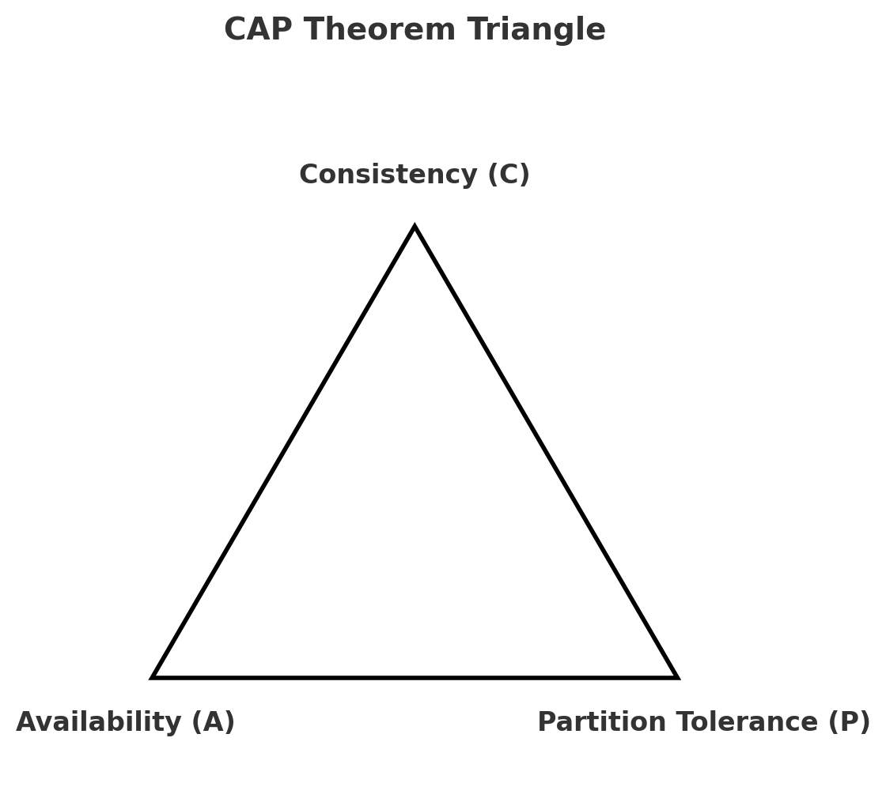
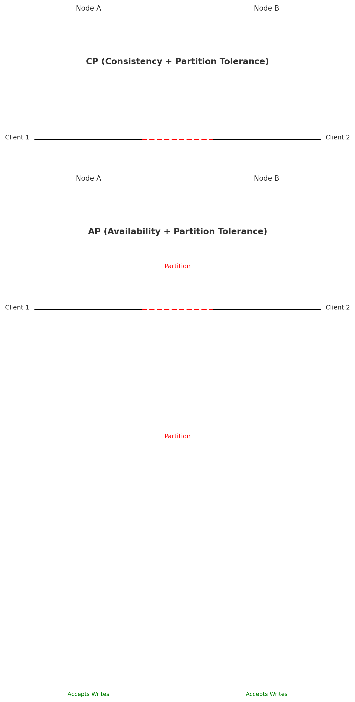

📘 CAP Theorem in System Design
1. Definition

The CAP theorem (Eric Brewer, 2000) states that in a distributed system, you can guarantee at most two out of three properties in the presence of a network partition:

Consistency (C)

Availability (A)

Partition Tolerance (P)

2. What Do C, A, and P Mean?

Consistency (C)
Every read reflects the latest successful write. Equivalent to having a single, up-to-date copy of data.

Availability (A)
Every request receives a non-error response, even if the response is not the latest.

Partition Tolerance (P)
The system continues functioning despite communication failures between nodes.

3. Diagram: 

Choosing CP means giving up some Availability.

Choosing AP means giving up strict Consistency.

CA only possible in non-distributed systems (no partitions).

4. High Availability vs Fault Tolerance

High Availability (HA)
Focus: Maximize uptime and minimize downtime.
Achieved by redundancy, failover, replication.
Example: Load-balanced web apps.

Fault Tolerance (FT)
Focus: Continue working correctly even after failures.
Achieved by masking failures (error correction, voting systems).
Example: Airplane control systems.

👉 HA ensures access, FT ensures correctness under failures.

5. CAP Trade-offs

CP Systems (Consistency + Partition Tolerance)
✅ Correct data, ❌ may reject requests during partition.
Examples: HBase, MongoDB (strong mode), Google Spanner.

AP Systems (Availability + Partition Tolerance)
✅ Always respond, ❌ may return stale data.
Examples: Cassandra, DynamoDB, Couchbase.

CA Systems (Consistency + Availability, no Partition Tolerance)
✅ Possible only in single-node/non-distributed databases.

6. Eric Brewer and Google Spanner

Eric Brewer: Proposed CAP in 2000, proven by Gilbert & Lynch in 2002.

Google Spanner: A globally distributed CP database that appears “CA-like.”

Uses TrueTime API (GPS + atomic clocks) to provide strong consistency across regions.

Innovation: synchronizing clocks to minimize uncertainty → global transactions.

7. System Design Questions Around CAP
   Q1. E-commerce Cart Service

Trade-off: Better to allow checkout than block users.

Choice: AP system (DynamoDB, Cassandra).

Reasoning: Eventual consistency is fine; reconciliation (fix carts later) is acceptable.

Q2. Banking / Payment Transactions

Trade-off: Incorrect balance is unacceptable.

Choice: CP system (Spanner, traditional RDBMS cluster).

Reasoning: Better to reject requests than show wrong balance.

Q3. Messaging Systems (WhatsApp, Kafka)

Trade-off: Messages should be delivered even if slightly delayed/stale.

Choice: AP system.

Reasoning: User experience > strict ordering. Eventual consistency is acceptable.

Q4. Design a Global Database

Challenge: Maintaining consistency across continents.

Choices:

Spanner (CP): Strong consistency using TrueTime.

DynamoDB (AP): Eventual consistency, but high availability.

Reasoning: Depends on workload: finance = CP, social apps = AP.

Q5. Partition Event Scenario

If DCs lose connection:

CP → Reject writes until partition heals (no stale data).

AP → Accept writes (may diverge, reconcile later).

Answer: Depends on domain (banking → CP, social → AP).

Q6. Why Can’t We Achieve CA in Distributed Systems?

Because partitions are inevitable in distributed networks.

Once P is required, you must choose between C or A.

CA only exists in single-node or failure-free systems.

8. Diagram: CP vs AP Flows
  

AP (Availability + Partition Tolerance)
---------------------------------------
Client 1 ---> Node A ---X--- Node B <--- Client 2
(partition happens)
Both nodes accept requests (may diverge).
Later reconciliation ensures eventual consistency.

9. Conclusion

CAP theorem forces distributed systems to choose trade-offs during partitions.

Most systems are AP or CP.

CA systems only exist in single-node setups.

Modern solutions (Spanner, Cosmos DB) push boundaries, but trade-offs remain.