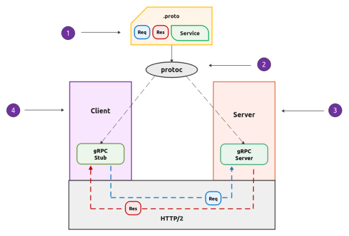

<h2>gRPC:</h2>




https://www.polarsparc.com/xhtml/gRPC-1.html

# gRPC – Key Facts & Clarifications

This document summarizes core gRPC concepts, addressing common statements.

---

1. **Binary format message exchange (Protocol Buffers)**
    - By default, gRPC uses [Protocol Buffers](https://developers.google.com/protocol-buffers) (Protobuf) for binary, schema-based serialization.
    - Other formats (e.g., JSON) are possible if both client and server agree.

2. **Shared contract (`.proto` file) required**
    - Both client and server need the same `.proto` schema to generate stubs in their target language.
    - This is a **contract-first** approach that ensures strong typing and compatibility.

3. **High throughput and low latency**
    - Binary encoding + HTTP/2 multiplexing = lower overhead than JSON/REST in most service-to-service scenarios.
    - Supports concurrent streams over a single TCP connection.

4. **Downside: shared contract needed**
    - Unlike REST, which can be explored dynamically, gRPC clients need the contract to compile stubs.
    - This can limit ad-hoc integrations but ensures safety and clarity in APIs.

5. **Bidirectional streaming**
    - gRPC supports:
        - Unary calls
        - Server streaming
        - Client streaming
        - Bidirectional streaming
6. **Serialization and compression compared to JSON**
    - Protobuf messages are typically **3–10× smaller** and faster to serialize than JSON.
    - This is due to binary encoding, not generic gzip compression.
    - Actual gains depend on data shape.
7. **gRPC vs J2EE RMI call**
    - Both are RPC-style, but:
      - RMI was Java-only, tightly coupled to Java EE app servers.
      - gRPC is language-agnostic, uses HTTP/2, supports streaming, and is cloud-native.
8. **Communication Protocol**
    - Standard gRPC **always uses HTTP/2 over TCP** (layer 4).
    - gRPC-Web can work over HTTP/1.1 via a proxy.
    - UDP/WebSocket are **not part of standard gRPC**.
---

## Summary

gRPC is a high-performance, contract-first RPC framework optimized for **internal, strongly typed, low-latency service communication**.  
It brings:
- Compact, schema-driven messages
- Streaming support
- Strong typing across languages
- HTTP/2 features like multiplexing and header compression

**Trade-offs:**
- Requires `.proto` sharing between client/server
- Less human-readable/debuggable than JSON
- Not as open/discoverable for public APIs as REST

---

# Schema Backward Compatibility in gRPC (with Protobuf)

This document explains how to evolve gRPC APIs **without breaking existing clients/servers**.  
Compatibility in gRPC is determined by **Protocol Buffers (Protobuf) schema evolution rules**.  
The transport layer (gRPC over HTTP/2) doesn’t enforce compatibility—your `.proto` contract does.

---

## Core Idea

Protobuf encodes data as **field numbers + wire types**.  
Unknown fields are **ignored** by receivers and typically **preserved** during parsing.  
If you avoid breaking the wire format, old and new clients/servers can still interoperate.

---

## Golden Rules

- **Never change or reuse field numbers**
- **Only add new fields** (with new numbers) or **new RPC methods** for extensions
- **Don’t change types/labels** (`optional`/`repeated`) of existing fields
- **Mark removed fields as `reserved`**
- **Evolve requests/responses by adding optional fields**
- Upgrade **servers first**, then **clients** (rolling upgrade)

---

## Safe vs. Breaking Changes

| Change                                  | Safe? | Notes |
|-----------------------------------------|-------|-------|
| Add a new field                         | ✅    | Use a unique field number |
| Remove a field (mark as `reserved`)     | ✅    | Prevents accidental reuse |
| Rename a field                          | ✅    | Field names aren’t on the wire |
| Reorder fields in `.proto`              | ✅    | Wire format unaffected |
| Change a field’s number/type/label      | ❌    | Breaks decoding |
| Reuse a removed field number            | ❌    | Causes corruption |
| Move a field into/out of `oneof`        | ❌    | Changes wire format |

---

## Service Method Evolution

- **Add new RPC methods** → ✅ Old clients won’t call them
- **Remove RPC methods** → ❌ Breaks any client still calling them
- **Change request/response type** → ❌ Unless only adding optional fields
- **Rename method** → ❌ Unless keeping the old one for migration

---

## Versioning Strategies

- **Package/version in `.proto`**  
  Example:
  ```proto
  package orders.v1;
  service OrderService { ... }

  package orders.v2;
  service OrderService { ... }
